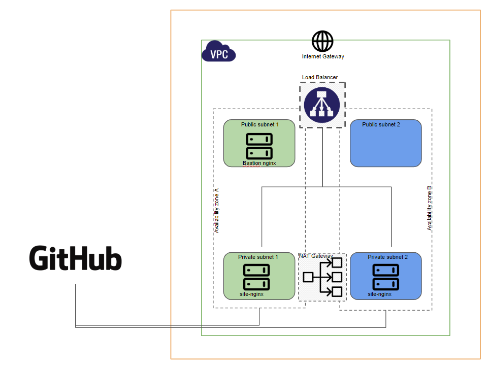

- Crear repositorio en github.com y crear un branch por assignment, cada branch debe tener un readme.md con el procedimiento para replicar, problemas encontrados, etc.
- Crear una Custom AMI usando Hashicorp Packer a partir de una AMI (Ubuntu/Centos) de el marketplace de AWS
    La imagen debe tener todos los paquetes necesarios para funcionar como webserver (Apache/NGINXy desplegar un website haciendo clone     de tu repositorio GIT donde este alojado el source del website.
- Puede descargar ejemplo de Websites desde https://www.free-css.com/free-css-templates 
- Crear un Ansible playbook que provisione la custom image con los paquetes/configuraciones necesarios para instalar un webserver e invocando el website       desde repositorio Git
- Tomando en cuenta las buenas prácticas de Hashicorp, deberá construirse la infraestructura utilizando Módulos por cada recurso a crear   y ser llamados desde el main script. El arbol de terraform debe estar compuesto por módulos para cada recurso, variables, main script,   terraform.tfvars y outputs.tf.
  El output.tf debe mostrar: url del loadbalancer para acceder al website, IP publica del bastion host y las IPs privadas de los website   hosts. 
- Usando Hashicorp Terraform crear un entorno web HA en AWS (Free Tier) que tenga:
  - VPC
  - Key Pair
  - Internet Gateway
  - Security Group for Bastion Host que permita acceso puerto 22 desde afuera.
  - Security Group for Website Hosts que permita acceso al puerto 22 y 80.
  - Security Group for load Balacer que permite acceso al puerto 80 desde todas las direcciones.
  - Elastic IP para el NAT Gateway
  - Nat Gateway
  - Public subnets
  - Private Subnets
  - Load Balancer y configurarle los targets
  - Bastion Host (Access/Provision) en la Public Subnet
  -  WebSite Hosts en la Private Subnets

